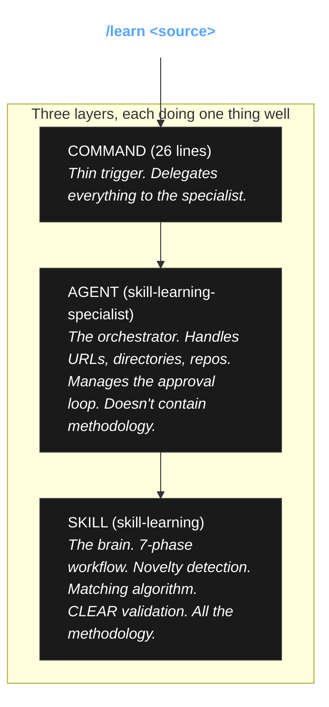

# SKILL.md — The Self-Improving Claude Code

Look at your current AI setup. You write a brilliant prompt. It works perfectly on Monday. But by Friday? A framework updates. A new pattern emerges. Your prompt is dead. It is rotting on your hard drive! *This is a tragedy of static configuration.*

We are going to fix this today. Not by writing more prompts. By building a system that *learns*.

This repository contains drop-in [Claude Code](https://docs.anthropic.com/en/docs/agents-and-tools/claude-code/overview) components that make your setup self-improving. I will demonstrate the flagship command: `/learn`.

Watch what happens when we unleash this system on the real world:

```bash
/learn https://svelte.dev/docs/kit          # We feed it documentation!
/learn ~/docs/architecture.md               # We feed it local designs!
/learn ~/.claude/plugins/marketplaces/      # We absorb other skills!
/learn ~/projects/my-api                    # We extract patterns from living code!
```

Read the SvelteKit 5 migration guide? Your `sveltekit-patterns` skill now knows about runes. Discovered a new Express middleware pattern? Your `api-middleware` skill just got smarter. It adapts!

---

## The Architecture: Three Fundamental Layers

If you put everything in one file, the system collapses into chaos. We must have a profound separation of concerns. Three layers. Each doing exactly one thing. It is beautiful!



**The Law of Separation**: Commands trigger! Agents orchestrate! Skills contain the methodology!

Why does this matter? Because commands must stay tiny. Agents must handle the messy, unpredictable real world (blocked URLs, missing directories). And the Skills—the *brains*—must hold pure, reusable knowledge that any agent can load. You must not mix them!

---

## The Experiments: What `/learn` Can Do

Let us run some experiments.

### Experiment 1: The Documentation
```bash
/learn https://docs.example.com/guide
```
It fetches the page. It extracts the technical patterns. It matches them to your existing skills. It shows you the diff, and upon your approval, it permanently alters its own brain.

### Experiment 2: The Living Codebase
```bash
/learn ~/projects/my-api
```
Are you tired of explaining your repo's conventions over and over? Point it here! It detects the project type. It finds your schemas, your middleware, your presets. It extracts your unique patterns and *creates a new skill* from what it finds.

### Experiment 3: The Marketplace
```bash
/learn ~/.claude/plugins/marketplaces/my-skills/
```
It discovers skills via AGENTS.md manifests or glob patterns. You choose: copy skills wholesale, or extract their insights to enhance your own. 

---

## The Demonstration of Novelty Detection

If you feed an AI everything, you teach it nothing! You bloat its context! You drown the signal in noise!

How do we prevent this? We use a strict, unforgiving filter: **Novelty Detection.** When `/learn` reads a document, it asks a beautiful, critical question: *"Does the model already know this?"*

We divide all knowledge into four tiers. Pay close attention to Tier 1:

| Tier | Status | What It Means |
|------|----------|---------------|
| 1 | **REJECTED!** | Training data. The model already knows it. We throw it away! |
| 2 | **ACCEPTED** | Implementation details. The precise *how*. |
| 3 | **HIGH VALUE** | Architectural trade-offs. The *why*. |
| 4 | **THE HOLY GRAIL** | Counter-intuitive. Contradicts standard assumptions. |

We are ruthless with Tier 1. We only inject Tiers 2, 3, and 4 into your skills. The result? Pure, concentrated signal. Your skills become incredibly potent, and the context window remains pristine.

*The system works!*

---

## The Laboratory Setup (Installation)

How do you build this in your own laboratory?

**Option 1: The Quick Start**
Each example mirrors the exact `~/.claude/` structure. You simply copy them over!

```bash
# Install the /learn command into your environment
cp -r examples/learn/commands/* ~/.claude/commands/
cp -r examples/learn/agents/* ~/.claude/agents/
cp -r examples/learn/skills/* ~/.claude/skills/
```

**Option 2: The Meta Experiment**
Point `/learn` at this very repository. Let the system learn how to build itself!
```bash
/learn ~/path/to/SKILL.md/examples/learn/
```

---

## We Must Verify Our Results!

We are not guessing here! You must lint your components before committing. We use [cclint](https://github.com/dotcommander/cclint):

```bash
# Install the instrument
go install github.com/dotcommander/cclint@latest

# Run the verification!
cclint ~/.claude/
```

It catches schema violations. It catches bloated agents. It ensures our fundamental laws are not broken. Every example in this repository passes `cclint`. It must balance!

---

## Contributing & Credits

Found a pattern worth sharing? Run your own experiments!
1. Fork this repository.
2. Add your discovery to `examples/`.
3. Follow the format.
4. Run `cclint` to verify your results.
5. Submit a PR.

**Credits:**
- [cclint](https://github.com/dotcommander/cclint) — The Claude Code component linter by [@dotcommander](https://github.com/dotcommander)

**License:** MIT. Remix it. Improve it.

---

<p align="center">
  <i>Static prompts rot. Self-improving configurations live forever.</i>
</p>