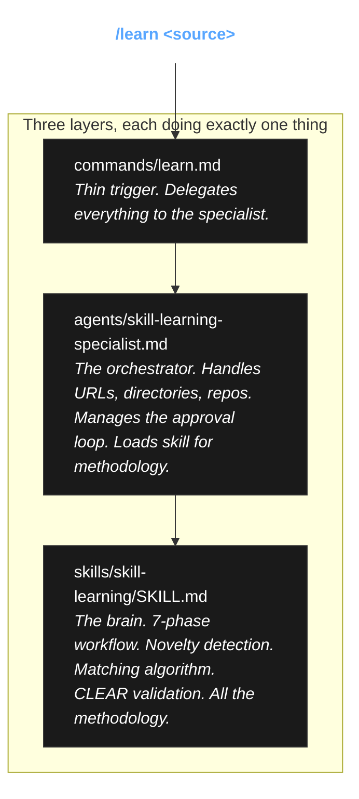

# The `/learn` Command: A Demonstration

**What if Claude could teach itself?**

Look at your screen. You have a magnificent AI. But its prompts? They are frozen in time! They are static! The web moves on, frameworks update, and your configuration rots. 

That ends today. I will show you the `/learn` command. Point it at a URL, a file, a skill marketplace, or an entire living codebase—and watch it extract patterns, match them to your existing skills, and permanently enhance your setup. Your Claude Code becomes a self-improving machine!

```bash
/learn https://svelte.dev/docs/kit          # We feed it documentation!
/learn ~/docs/architecture.md               # We feed it local designs!
/learn ~/.claude/plugins/marketplaces/      # We absorb other skills!
/learn ~/projects/my-api                    # We extract patterns from living code!
```

---

## The Chain: A Beautiful Separation of Concerns

If you put all of this logic into one file, you will create a monster. It will be unmaintainable. We must use three distinct layers. Notice the elegance!



**The pattern is absolute**: Commands trigger! Agents orchestrate! Skills contain the methodology!

---

## The Laboratory Setup (Structure)

Here is how the instruments are laid out in this folder:

```
learn/
├── README.md                              # You are here
├── commands/
│   └── learn.md                           # The trigger
├── agents/
│   └── skill-learning-specialist.md       # The orchestrator
└── skills/
    └── skill-learning/
        └── SKILL.md                       # The brain
```

---

## Deploying the Instruments (Installation)

Do you want to run this experiment yourself? Copy these precise files into your Claude Code configuration. 

```bash
# 1. Deploy the Command
cp commands/learn.md ~/.claude/commands/

# 2. Deploy the Agent
cp agents/skill-learning-specialist.md ~/.claude/agents/

# 3. Deploy the Skill
mkdir -p ~/.claude/skills/skill-learning
cp skills/skill-learning/SKILL.md ~/.claude/skills/skill-learning/
```

*The system is now armed and ready!*

---

## The Conclusion: Pure Signal

Most Claude Code setups have static prompts that rot over time. `/learn` makes your configuration *alive*:

- Read the SvelteKit 5 migration guide? Your `sveltekit-patterns` skill now knows about runes!
- Found a plugin marketplace? You can copy the good skills directly!
- Analyzing a reference implementation? Extract the brilliant patterns into entirely new skills!

The secret to this entire operation is **novelty detection**. If you feed an AI everything, you drown the signal in noise. `/learn` uses a ruthless filter—only Tier 2-4 insights (the *how*, the *why*, and the *counter-intuitive*) make it into your skills. No training data bloat. No redundancy. Just pure, concentrated signal that actually makes your setup better.

*Physics works! And so does this!*