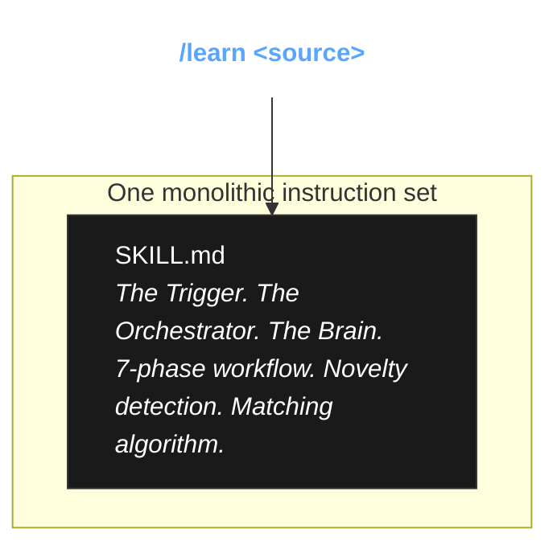

# The `/learn` Command (OpenCode / Unified Edition)

**What if your AI assistant could teach itself?**

The primary `learn` example in this repository is designed specifically for Anthropic's [Claude Code](https://docs.anthropic.com/en/docs/agents-and-tools/claude-code/overview), utilizing a highly structured Thin-Command → Thin-Agent → Fat-Skill pipeline.

However, many developers use other AI assistants (like **OpenCode**, Cursor, Aider, or even bare CLI wrappers) that do not enforce this strict separation of concerns. In these environments, you often just need **one single, unified prompt** that does it all.

This directory contains `SKILL.md`—a unified, fat-skill version of the `/learn` workflow. It combines the command trigger, the agent orchestration loop, and the deep novelty-detection methodology into a single file.

---

## The Unified Architecture

Instead of three layers, this is one monolithic instruction set designed for assistants that run on a single system prompt or load skills directly via context injection.



---

## Deploying the Instrument (Installation)

Do you want to run this experiment in OpenCode or another unified assistant? Copy this file into your agent's configuration. 

```bash
# For OpenCode: Deploy the Skill
mkdir -p ~/.config/opencode/skills/opencode-learn
cp SKILL.md ~/.config/opencode/skills/opencode-learn/SKILL.md
```

Then, whenever you want your assistant to extract knowledge, simply type:

```bash
/learn https://docs.example.com/guide
```

Or, if your assistant doesn't support slash commands, simply ask:

> "Please load the opencode-learn skill and extract patterns from `https://docs.example.com/guide`"

---

## The Conclusion: Pure Signal

Just like the Claude Code version, the secret to this unified operation is **novelty plus leverage**. If you feed an AI everything, you drown the signal in noise. This unified skill first rejects Tier 1 training-data knowledge, then rejects anything that will not change future behavior. The surviving insights are source-backed rules, workflow changes, validation gates, and failure-preventing exceptions.

Good learning also prunes. If a new source makes old guidance stale, the proposal should replace or qualify the old rule instead of blindly appending another paragraph. The skill gets sharper, not merely longer.

*Physics works! And so does this!*
